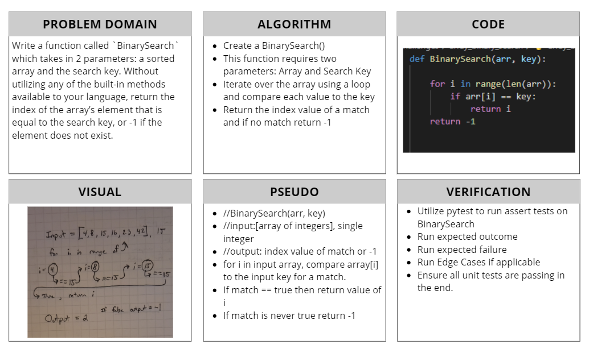

# Binary search in a sorted 1D array
[Table of Contents](../../../README.md)
## Challenge 03
Write a function called `BinarySearch` which takes in 2 parameters: a sorted array and the search key. Without utilizing any of the built-in methods available to your language, return the index of the array’s element that is equal to the search key, or -1 if the element does not exist.

### Example:
|Input|Output|
|:-----|:------:|
|[4,8,15,16,23,42], 15|2|
|[11,22,33,44,55,66,77], 90|-1|

## Approach & Efficiency
In BinarySearch function I needed a way to compare the search key value to each element of the input array. To do this I utlized a for in range loop with the range equal to the length of the input array. Each iteration array at i was compared to the search key, if a match occured then stop looping and return that index value. If the loop completes its cycle with no match then it hits the return -1 block.

Fixed Approach: I read the article about halfing the search result in order to determine value. To do this I calculated the total length of the array and determined the middle index. Then with some if/else conditionally logic to determine if the key is higher or lower from there cut the array in half and search the half that the is true. Continue this until the number is found.

## Solution

