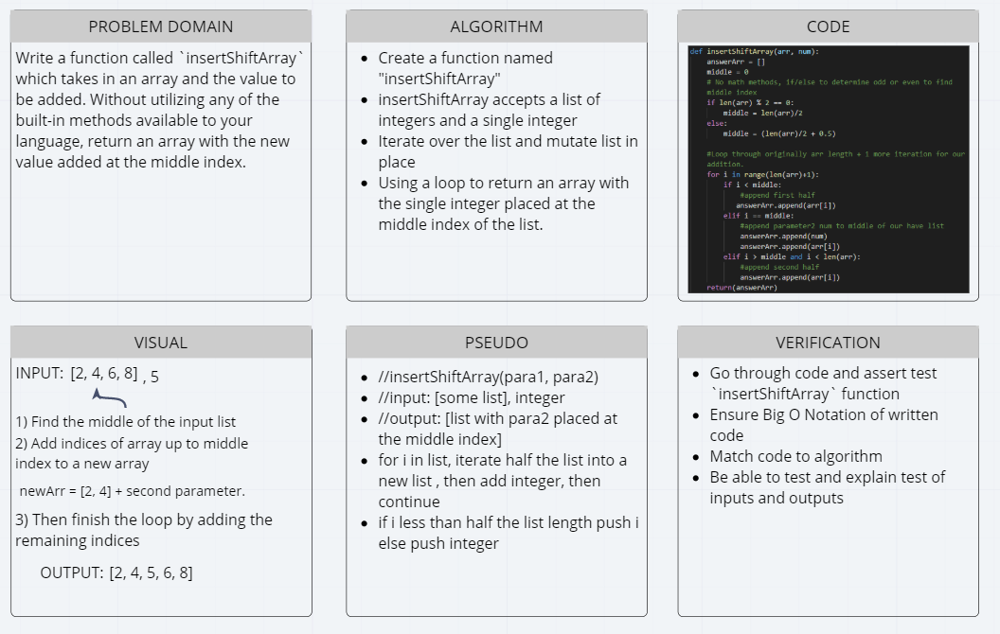

# Insert and Shift an Array
[Table of Contents](../../../README.md)
## Challenge 02
Write a function called `insertShiftArray` which takes in an array and the value to be added. Without utilizing any of the built-in methods available to your language, return an array with the new value added at the middle index.

### Example:
|Input|Output|
|-----|------|
|`[2,4,6,8], 5`|`[2,4,5,6,8]`|
|`[4,8,15,23,42], 16`|`[4,8,15,16,23,42]`|

## Approach & Efficiency
I decided to not use math methods or library to determine the exact middle of an inputted list. To make this more efficient we can use that to remove the if/else from the start of my function. Using a for i in range loop, we are setting an exact amount of iterations and for each iteration this function was appending items to the answer array. Last it was returned as a final product.

## Solution

