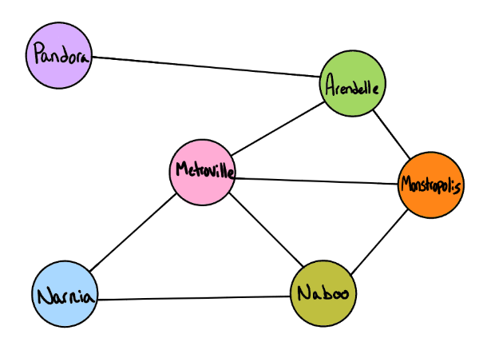

# Breadth First with Graphs
[Table of Contents](../../../README.md)
## Challenge 36

Implement a breadth-first traversal on a graph.


## Features
- [] Extend your graph object with a breadth-first traversal method that accepts a starting node. Without utilizing any of the built-in methods available to your language, return a collection of nodes in the order they were visited. Display the collection.

## Examples

`Input:`



`Output:`
```
 [Pandora, Arendelle, Metroville, Monstroplolis, Narnia, Naboo]
```
---
## Approach & Efficiency


---

## Solution

