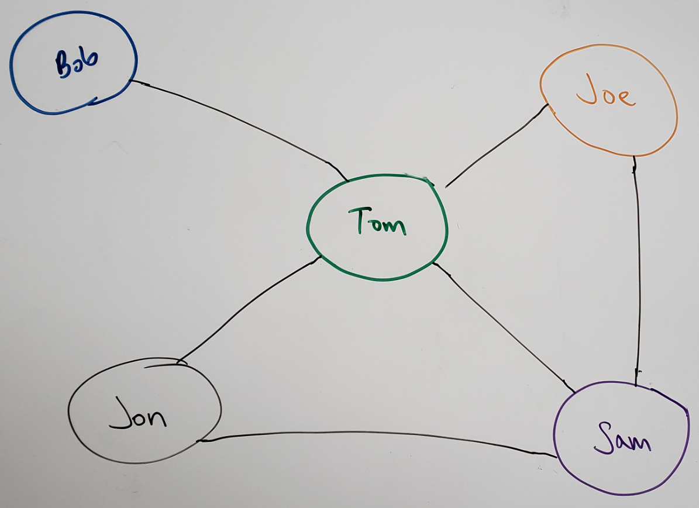

# Breadth First with Graphs
[Table of Contents](../../../README.md)
## Challenge 36

Implement a breadth-first traversal on a graph.


## Features
- [x] Extend your graph object with a breadth-first traversal method that accepts a starting node. Without utilizing any of the built-in methods available to your language, return a collection of nodes in the order they were visited. Display the collection.

## Examples

`Input:`


`Output:`
```
 [Pandora, Arendelle, Metroville, Monstroplolis, Narnia, Naboo]
```
`Input:`



`Output:`
```
[Bob, Tom, Jon, Sam, Joe]
```

---
## Approach & Efficiency

After reviewing the reading assignment on graphs and following the pseudo code. This breadth first traversal has a time complexity of O(N^2). We have a while loop, this loops through N times based on the number of nodes in our graph. Then for each node, we will for loop each relationship that node might have, which is N edges. We are using a holder set, to keep track of the visited nodes and at the very end we return a collection of the nodes, O(n) in space.

---

## Solution

