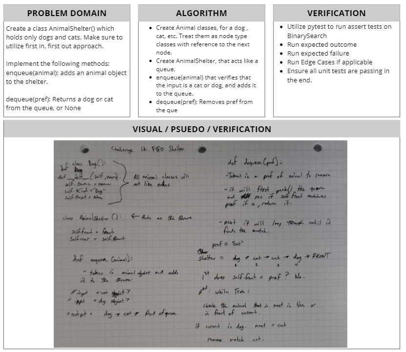

# First-in, First out Animal Shelter.
[Table of Contents](../../../README.md)
## Challenge 12
Create a class called AnimalShelter which holds only dogs and cats. The shelter operates using a first-in, first-out approach.
Implement the following methods:
- `enqueue(animal)`: adds `animal` to the shelter. `animal` can be either a dog or a cat object.
- `dequeue(pref)`: returns either a dog or a cat. If `pref` is not `dog` or `cat` then return `None`.
---
## Approach & Efficiency
The objective was to create an AnimalShelter, which is pretty much a queue implementation. I utilized the standard queue operations but adjusted them to handle animal objects. Enqueue an animal is no different than any other queue which will add a new animal to the rear of the queue with O(1) time efficiency. Dequeue is a bit different it takes in a preference of either a dog or cat to remove from the queue. At first will act like a regular queue and checks the front to see if its a match, if it is, then remove it using O(1) time efficiency other wise we will traverse the entire queue until a match is found, resulting in an O(n) time efficiency overall. The space efficiency remains O(1) as we do not add, alter, or create any copies of the current stack during any of these operations.

---

## Solution

