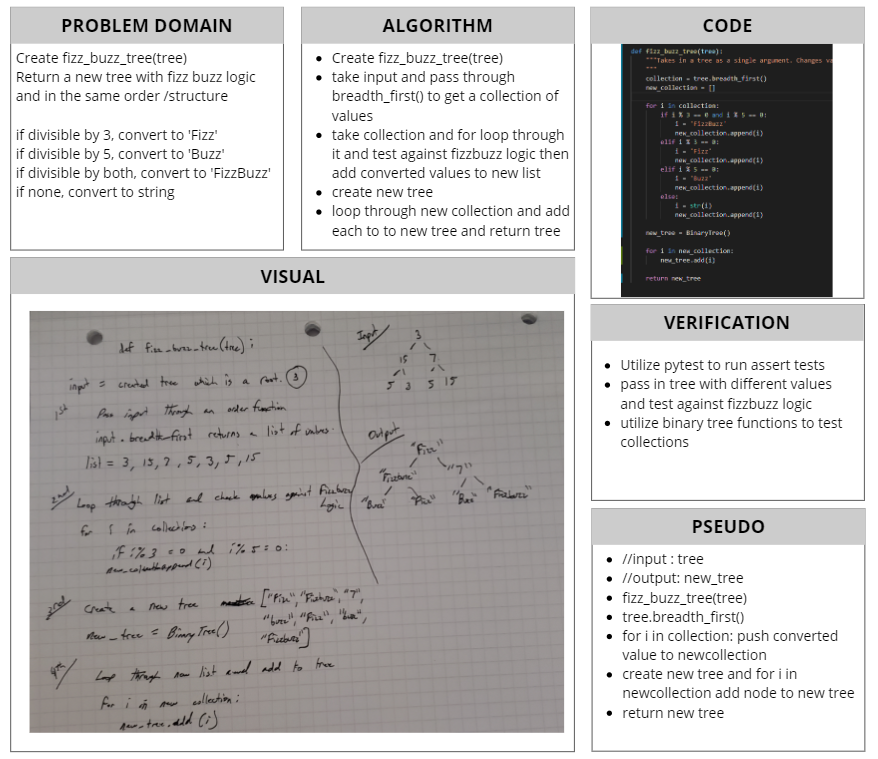

# Fizz Buzz Tree
[Table of Contents](../../../README.md)
## Challenge 16
Conduct "FizzBuzz" on a tree while traversing through it. Change the values of each of the nodes dependent on the current node's value.

## Features
- [ ] Write a function called `fizz_buzz_tree()` which takes a tree as an argument.
- [ ] Determine whether or not the vlaue of each node is divisible by 3, 5, or both. Create a new tree with the same structure as the original but the values modified as follows:
    - [ ] If the value is divisible by 3, replace the value with "Fizz".
    - [ ] If the value is divisible by 5, replace the vlaue with "Buzz".
    - [ ] If the value is divisible by 3 and 5, replace the value with "FizzBuzz"
    - [ ] If the value is not divisible by 3 or 5, simply turn the number into a String.
- [ ] Return the new tree.

## Approach & Efficiency

## Solution

