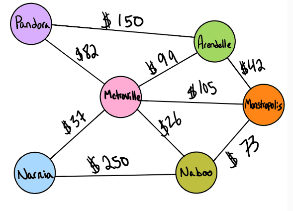
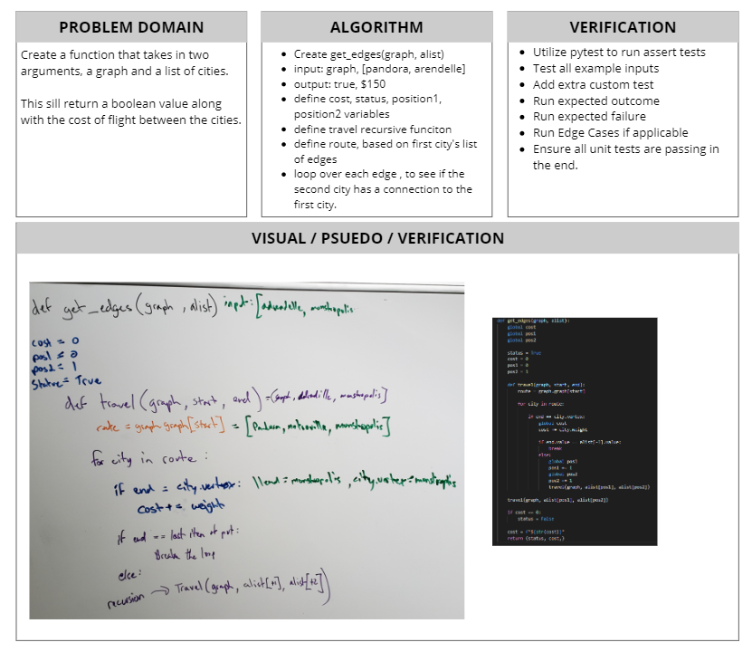

# Get Edges with Graphs
[Table of Contents](../../../README.md)
## Challenge 37

Given a business trip itinerary, and an Alaska Airlines route map, is the trip possible with direct flights? If so, how much will the total trip cost be?

## Features
- [x] Write a function based on the specifications above, which takes in a graph, and an array of city names. Without utilizing any of the built-in methods available to your language, return whether the full trip is possible with direct flights, and how much it would cost.

## Examples

`Graph`

|Input|Output|
|-----|-----|
|[Metroville, Pandora]|True, $82|
|[Adrendelle, Monstropolis, Naboo]| True, $115|
|[Naboo, Pandora]| False, $0|
|[Narnia, Arendelle, Naboo]| False, $0|
|[Pandora, Metroville, Narnia, Naboo, Monstropolis, Adrendelle, Pandora]| True, $634|

---
## Approach & Efficiency

I originally though I could accomplish this task utilizing a for loop alone, but did not know how I would be able to search the relationship of next city in the list of cities. So the next thing that came to mind was recursion, I went ahead and made a travel function inside, this function is call for each city in the list of cities to travel, if they had a connection to the starting city. So currently the time complexity is an O(N) for the number of cities in the initial route. It will call recursion on the travel function for each connecting city, and O(N) for its edges. Space is not taking up aditional space, we are just creating two local variables of cost and status, and returning them at the end.

---

## Solution

