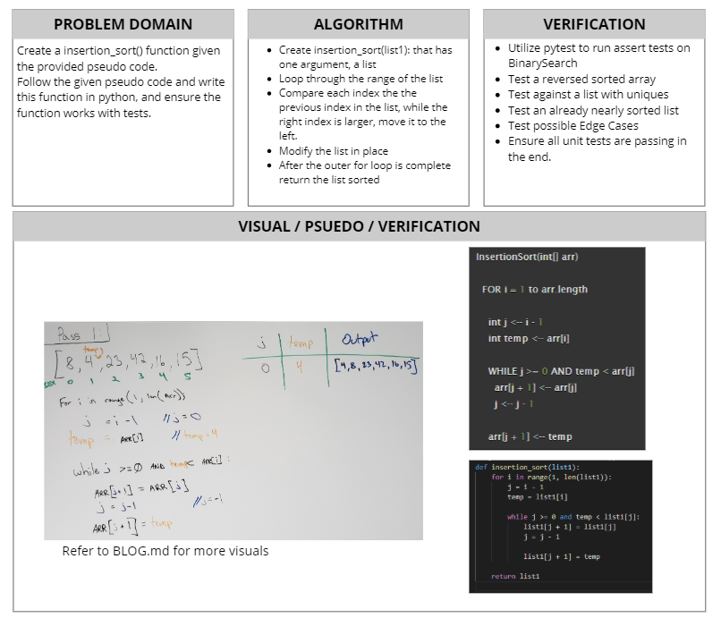

# Insertion Sort
[Table of Contents](../../../README.md)
## Challenge 26
Based on this pseudo code below make a blog walking through the code. Then create a working solution with tests.

Checkout the blog here: [Blog Link](./BLOG.md)

PSEUDO CODE:
```py
    InsertionSort(int[] arr)

    FOR i = 1 to arr.length

        int j <--i-1

        int temp <--arr[i]

        WHILE j >= 0 AND temp < >arr[j]
            arr[j + 1] <-- arr[j]
            j <-- j - 1

        arr[j + 1]<-- temp
```

### Examples:
`insertion_sort(list)`
|Arg `list`|Output|
|------|-----|
|`[8,4,23,42,16,15]`|`[4, 8, 15, 16, 23, 42]`|
|`[20,18,12,8,5,-2]`|`[-2, 5, 8, 12, 18, 20]`|
|`[5,12,7,5,5,7]`|`[5, 5, 5, 7, 7, 12]`|
|`[2,3,5,7,13,11]`|`[2, 3, 5, 7, 11, 13]`|

### Unit Tests
1. [x] Sort an inputed list that is already Reverse-sorted: `[20, 18, 12, 8, 5, -2]`
2. [x] Sort an inputed list that has a few uniques: `[5,12,7,5,5,7]`
3. [x] Sort an inputed list that is nearly sorted: `[2,3,5,7,13,11]`

## Approach & Efficiency
This functions basic operations is to compare each index of a list and re-order them based on value. In order to do this we start off with a for loop, O(N). We loop through a the range of the inputed list and for each one we check to see if a condition is met for a while loop. This while loop can run O(n) times as it will continue to move a value as long as its the smaller value in the comparision. This results in O(n^2) time. Space is never change, leaving us with O(1) as the list is changed in place, and no new space is required.

## Solution
Checkout the blog for more visual pictures: [Blog Link](./BLOG.md)


