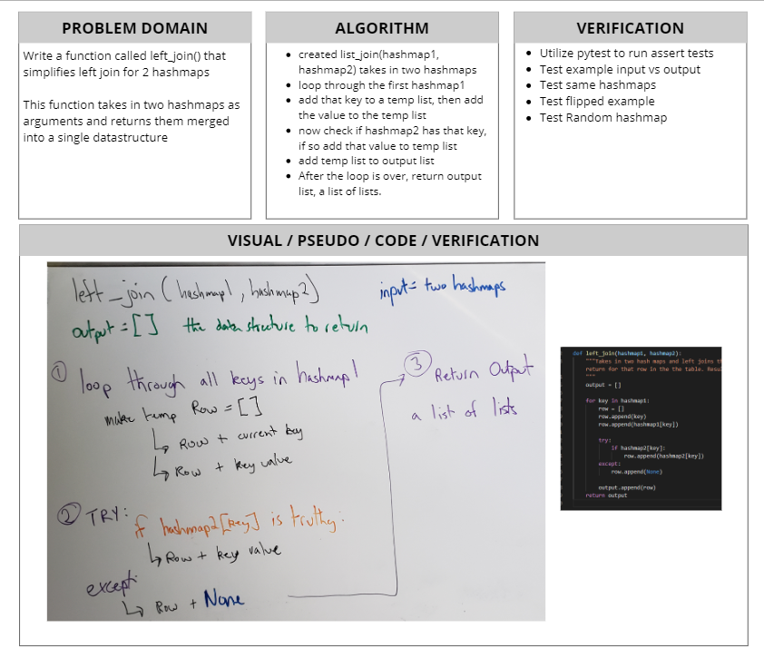

# Left Join for HashMaps
[Table of Contents](../../../README.md)
## Challenge 32

Implement a simplified LEFT JOIN for 2 Hashmaps.

## Features
- [x] Write a function that LEFT JOINs two hashmaps into a single data structure.
- [x] The first parameter is a hashmap that has word strings as keys, and a synonym of the key as values.
- [x] The second parameter is a hashmap that has word strings as keys, and antonyms of the key as values.
- [x] Combine the key and corresponding values (if they exist) into a new data structure according to LEFT JOIN logic.
- [x] LEFT JOIN means all the values in the first hashmap are returned, and if values exist in the “right” hashmap, they are appended to the result row. If no values exist in the right hashmap, then some flavor of `None` should be appended to the result row.
- [x] The returned data structure that holds the results is up to you. It doesn’t need to exactly match the output below, so long as it achieves the LEFT JOIN logic.
- [x] Avoid utilizing any of the library methods available to your language.

## Examples

---
## Approach & Efficiency

The way I built this function was take in the two hash maps and we know all the keys in the first hashmap is the ones that are staying, and the ones in the left are merging over. So I choose to loop over all the keys in hashmap1. During this loop, we will create a row list, we will append the key of the hash map, followed by the value from hashmap1. Then we search the second hashmap with the key from hashmap1, this is an o1 lookup time if there were no collisions in the hashmap. If a value is found for that given key in hashmap2, we append that to our row list. After both hashmaps have been looked at, we take that holder row list and append it to our output list. A list of lists.

O(n) time given the length of the left hashmap, and O(n) space based on the number of keys in left hashmap.

---

## Solution

