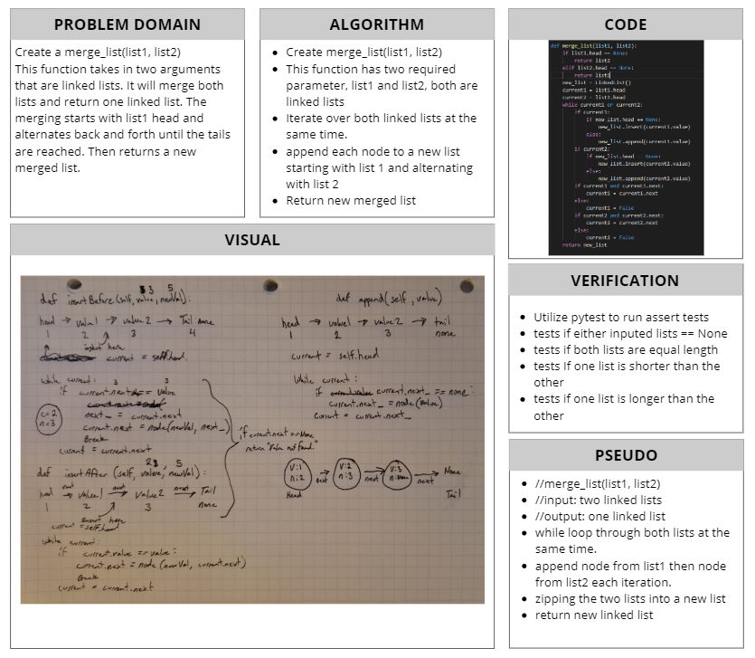

# Linked List Insertions
[Table of Contents](../../../README.md)
## Challenge 06
Extend your LinkedList Class:
- [x] Write a `kth_from_end(k)`method for the Linked List Class which takes a number, `k`, as a parameter.
    - [x] Return the node's value that is `k` from the end of the linked list. You have access to the Node class and all the properties on the Linked List class as well as the methods created in previous challenges.
### Examples:
`merge_lists(list1, list2)`
|Arg `list1`|Arg `list2`|Output|
|------|-----|------|
|head -> [1] -> [3] -> [2] -> X|head -> [5] -> [9] -> [4] -> X|head -> [1] -> [5] -> [3] -> [9] -> [2] -> [4] -> X|
|head -> [1] -> [3] -> X|head -> [5] -> [9] -> [4] -> X|head -> [1] -> [5] -> [3] -> [9] -> [4] -> X|
|head -> [1] -> [3] -> [2] -> X|head -> [5] -> [9] -> X|head -> [1] -> [5] -> [3] -> [9] -> [2] -> X|

### Unit Tests
1.  [x] Merge two linked lists where list1 and list2 are equal length
2.  [x] Merge two linked lists where list1 is shorter than list2
3.  [x] Merge two linked lists where list1 is longer than list2

## Approach & Efficiency

## Solution

