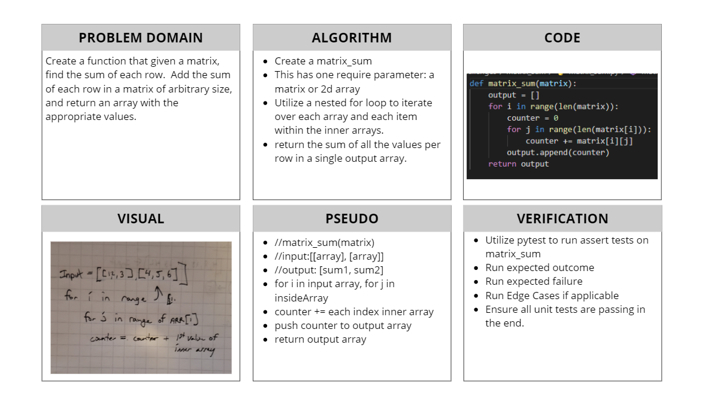

# Matrix, Find the sum of each Row
[Table of Contents](../../../README.md)
## Challenge 04
Given a matrix, find the sum of each row.

### Example:
|Input|Output|
|-----|------|
|`[ [1, 2, 3], [3, 5, 7], [1, 7, 10] ]`|`[6, 15, 18]`|
|`[ [0, 1, 5], [-4, 7, 2], [-3, 12, 11] ]`|`[6, 5, 20]`|

## Approach & Efficiency
When it comes to working with matrixs the first that populates in my brain is nested for loops. Currently this is my only approach to solving such a problem. The outer loop
controls which array or row you are working on. While the inner loop will go through that array or row and count each index.

## Solution

