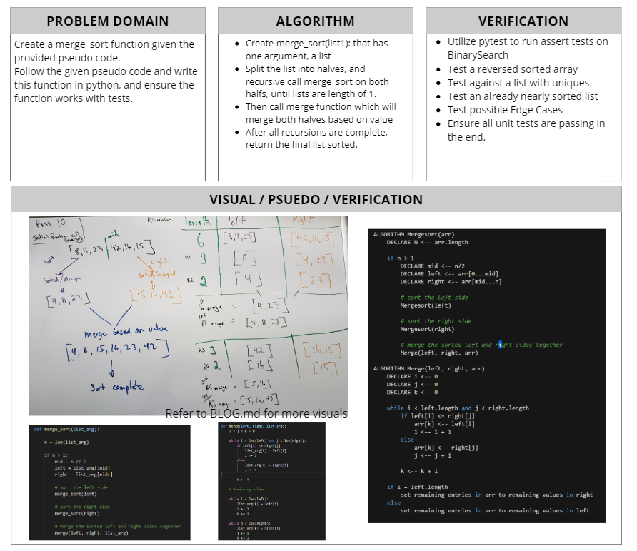

# Merge Sort
[Table of Contents](../../../README.md)
## Challenge 27
Based on this pseudo code below make a blog walking through the code. Then create a working solution with tests.

Checkout the blog here: [Blog Link](./BLOG.md)

PSEUDO CODE:
```py
    ALGORITHM Mergesort(arr)
        DECLARE N <-- arr.length

        if n > 1
            DECLARE mid <-- n/2
            DECLARE left <-- arr[0...mid]
            DECLARE right <-- arr[mid...n]

            # sort the left side
            Mergesort(left)

            # sort the right side
            Mergesort(right)

            # merge the sorted left and right sides together
            Merge(left, right, arr)

    ALGORITHM Merge(left, right, arr)
        DECLARE i <-- 0
        DECLARE j <-- 0
        DECLARE k <-- 0

        while i < left.length and j < right.length
            if left[i] <= right[j]
                arr[k] <-- left[i]
                i <-- i + 1
            else
                arr[k] <-- right[j]
                j <-- j + 1

            k <-- k + 1

        if i = left.length
            set remaining entries in arr to remaining values in right
        else
            set remaining entries in arr to remaining values in left
```

### Examples:
`merge_sort(list)`
|Arg `list`|Output|
|------|-----|
|`[8,4,23,42,16,15]`|`[4, 8, 15, 16, 23, 42]`|
|`[20,18,12,8,5,-2]`|`[-2, 5, 8, 12, 18, 20]`|
|`[5,12,7,5,5,7]`|`[5, 5, 5, 7, 7, 12]`|
|`[2,3,5,7,13,11]`|`[2, 3, 5, 7, 11, 13]`|

### Unit Tests
1. [x] Sort an inputed list that is already Reverse-sorted: `[20, 18, 12, 8, 5, -2]`
2. [x] Sort an inputed list that has a few uniques: `[5,12,7,5,5,7]`
3. [x] Sort an inputed list that is nearly sorted: `[2,3,5,7,13,11]`

## Approach & Efficiency
The approach to merge sort, is that given a list we split the list into halves. We continue to split the lists in half until the length of 1 is reached, then we begin to merge them back together based on value. Time complexity for this type of function results in O(log(n)) since it is similiary to a binary tree, continually splitting on it self. Space however remains unchanged. Yes we split the lists each time, but we are not adding too the lists, so the size never changes, and in the end, we take up the same amount of space it had before. Since we split a list down to single elements, we get a space complexity of O(n) but then as we merge this list back together, we return to the original list space.

## Solution
Checkout the blog for more visual pictures: [Blog Link](./BLOG.md)


