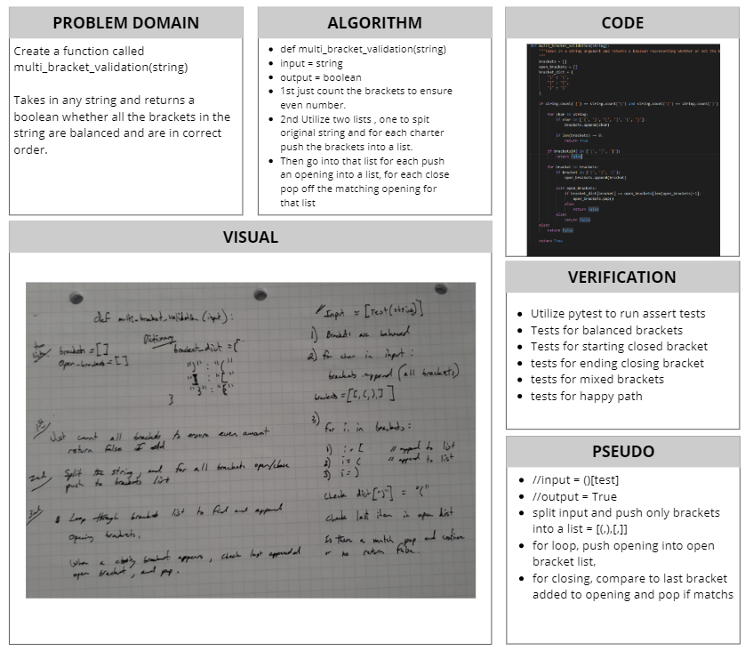

# Multi-Bracket Validation
[Table of Contents](../../../README.md)
## Challenge 13
Multi-Bracket Validation is a challenge to verify that an inputed string has balanced brackets. It will return a boolean representing whether or not the brackets in the string are balanced. There are three types of brackets:
- Round Brackets: `()`
- Square Brackets: `[]`
- Curly Brackets: `{}`

### Examples:
`multi_bracket_validation(input)`
|Input|Output|
|:-----:|:-----:|
|`{}`|`True`|
|`{}(){}`|`True`|
|`()[[Extra Characters]]`|`True`|
|`(){}[[]]`|`True`|
|`{}{Code}[Fellows](())`|`True`|
|`[({}]`|`False`|
|`(](`|`False`|
|`{(})`|`False`|

## Approach & Efficiency

## Solution

