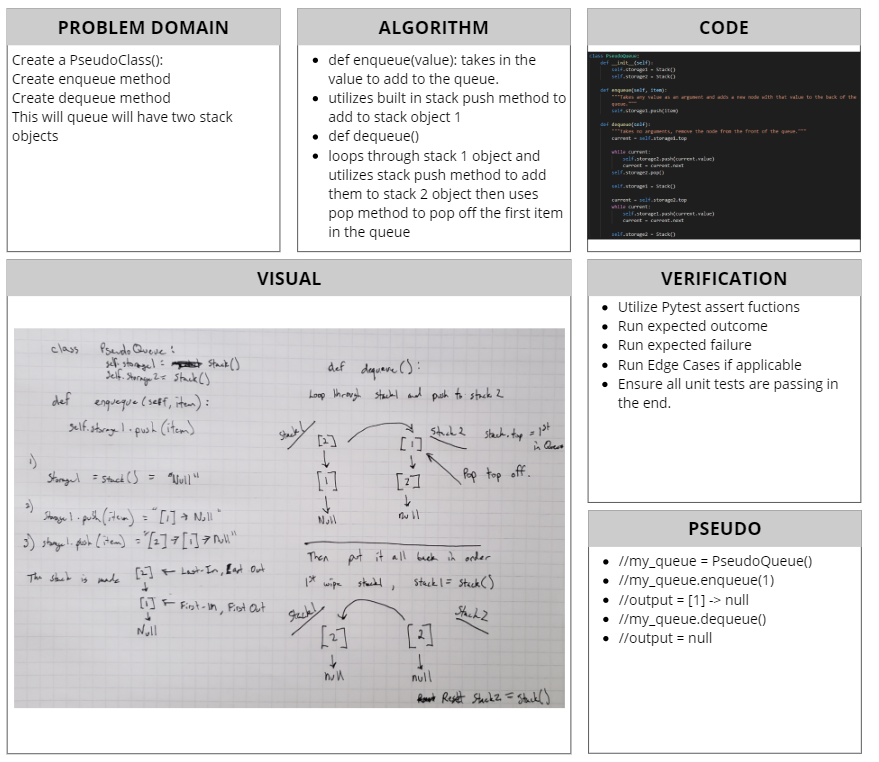

# Queue with Stacks
[Table of Contents](../../../README.md)
## Challenge 11
Create a brand new `PseudoQueue` class. Do not use an existing Queue. Instead, this PseudoQueue class will implement our standard queue interface (the two methods listed below), but will internally only utilize 2 Stack objects. Ensure that you create your class with the following methods:
- `enqueue(value)` which inserts `value` into the PseudoQueue, using a first-in, first-out approach.
- `dequeue()` which extracts a `value` from the PseudoQueue, using first-in, first-out approach.

The `Stack` instances have only `push`, `pop`, and `peek` methods. You should use your own Stack implementation. Instantiate these Stack objects in your PseudoQueue constructor.

### Example:
----
`enqueue(value)`
|Input|Args|Output|
|:-----|:-----:|-----:|
|`[10]->[15]->[20]`|`5`|`[5]->[10]->[15]->[20]`|
|`empty queue`|`5`|`[5]`

---

`dequeue()`
|Input|Output|Internal State|
|:-----|:-----:|-----:|
|`[5]->[10]->[15]->[20]	`|`20`|`[5]->[10]->[15])`|
|`[5]->[10]->[15]`|`15`|`[5]->[10]`

---
## Approach & Efficiency
This is not the best solution for managing a queue. Utilizing two stacks to "slinking" between in order to maintain the First-In-First-Out is a Big-O Nightmare. I had to utilize a while loop, to iterate over the first stack to retreive the bottom, or first out node. Then reverse the process to return the stack back to normal so any additional items added to the queue were after those already placed in queue.

## Solution

