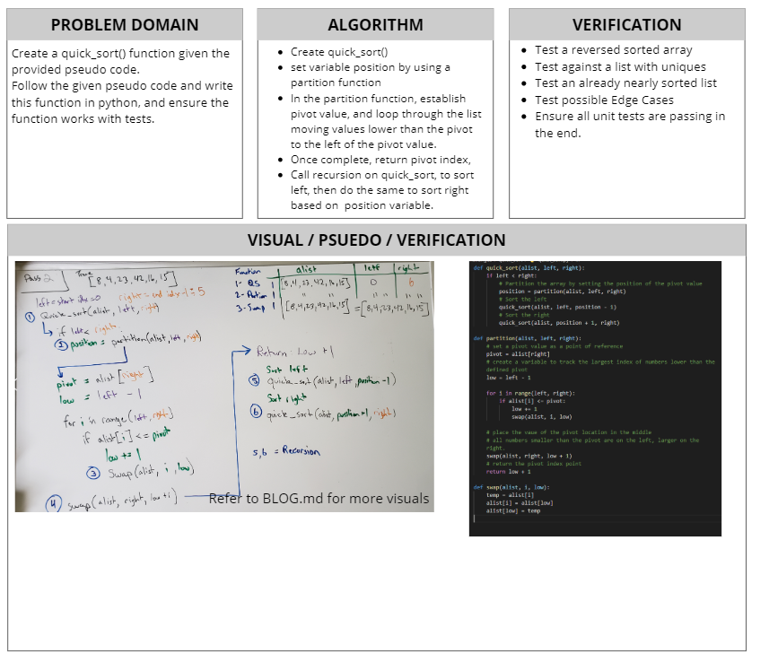

# Quick Sort
[Table of Contents](../../../README.md)
## Challenge 28
Based on this pseudo code below make a blog walking through the code. Then create a working solution with tests.

Checkout the blog here: [Blog Link](./BLOG.md)

PSEUDO CODE:
```py
ALGORITHM QuickSort(arr, left, right)
    if left < right
        # Partition the array by setting the position of the pivot value
        DEFINE poisition <-- Partition(arr, left, right)
        # Sort the left
        QuickSort(arr, left, position -1)
        # Sort the right
        QuickSort(arr, position + 1, right)

ALGORITHM Partition(arr, left, right)
    # set a pivot value as a point of reference
    DEFINE pivot <-- arr[right]
    # create a variable to track the largest index of numbers lower than the defined pivot
    DEFINE low <-- left - 1

    for i <- left to right do
        if arr[i] <= pivot
            low++
            Swap(arr, i, low)

    # place the value of the pivot location in the middle.
    # all numbers smaller than the pivot are on the left, larger on the right.

    Swap(arr, right, low + 1)
    # return the pivot index point

    return low + 1

ALGORITHM Swap(arr, i, low)
    DEFINE temp;

    temp <-- arr[i]
    arr[i] <-- arr[low]
    arr[low] <-- temp


```

### Examples:
`quick_sort(list, left, right)`
|Arg `list`|Output|
|------|-----|
|`[8,4,23,42,16,15]`|`[4, 8, 15, 16, 23, 42]`|
|`[20,18,12,8,5,-2]`|`[-2, 5, 8, 12, 18, 20]`|
|`[5,12,7,5,5,7]`|`[5, 5, 5, 7, 7, 12]`|
|`[2,3,5,7,13,11]`|`[2, 3, 5, 7, 11, 13]`|

### Unit Tests
1. [] Sort an inputed list that is already Reverse-sorted: `[20, 18, 12, 8, 5, -2]`
2. [] Sort an inputed list that has a few uniques: `[5,12,7,5,5,7]`
3. [] Sort an inputed list that is nearly sorted: `[2,3,5,7,13,11]`

## Approach & Efficiency
Time O(n)
- The basic algorithm for Quick Sort is to partition the list based ona pivot value, and utilizing recursion to break this list down sorting smaller numbers to the left of the pivot and larger numbers to the right. First time through a position is deteremined, and then recursion on main function is called to sort the left then the right based on exact pivot location. This will result in a O(n) performance as we are touching each part, utilzing a for loop.

Space O(n)
- The space can vary based on the type of quick sort used, in this version of quick sort we have a set pivot over a random pivot. Now the best space complexity still is O(n) as the fixed pivot could be the lowest number.

## Solution
Checkout the blog for more visual pictures: [Blog Link](./BLOG.md)


