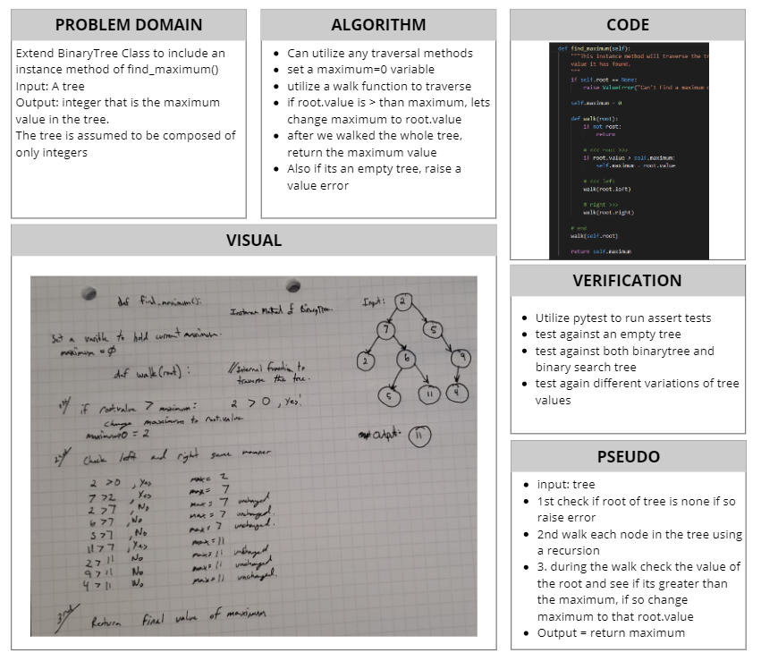

# Implementation: Tree Expanded: Find Maximum
[Table of Contents](../../../README.md)
## Challenge 18
Expansion of Tree to include a Find the Maximum Value instance methods.

## Features
- [x] Create a Node class that has properties for the value stored in the node, the left child node, and the right child node.
- [x] Create BinaryTree class:
    - [ ] Define a method for each of the depth first traversals which returns an array of the values, ordered appropriately.
        - [x] `pre_order`
        - [x] `in_order`
        - [x] `post_order`
        - [x] `breadth_first`
        - EXPANDED FEATURE:
            - [x] `find_maximum`

- [x] Create a BinarySearchTree class:
    - [x] Define a method named `add` that accepts a value, and adds a new node with that value in the correct location in the binary search tree.
    - [x] Define a method named `contains` that accepts a value, and returns a boolean indicating whether or not the value is in the tree at least once.

### Unit Tests
1. [x] Can successfully instantiate an empty tree.
2. [x] Can successfully instantiate a tree with a single root node.
3. [x] Can successfully  add a left child and a right child to a single root node.
4. [x] Can successfully return a collection from a preorder traversal.
5. [x] Can successfully return a collection from an inorder traversal.
6. [x] Can successfully return a collection from a postorder traversal.
7. [x] Can successfully return a collection from a breadth first traversal.
8. [x] Can successfully find the maximum value from a binary tree.

## Approach & Efficiency
All the functions within super class, pre, post, and in order functions are all utilzing recursion. This is not terrible as it will only invoke that function once per node. This gives us a O(n) efficiency. Space is a bit tricky we are creating lists for each method, O(1) and thats not counting the actually node or tree it self.

Breadth First, utilizes recursion as well as a queue. Adding and removing items with O(1) and the recursion is O(n).

Find Maximum, utilizes recursion to traverse to each node in the tree. During this time, we are comparing the root value to the a maximum value. We are not creating any additional space except for having a current maximum variable. This process is O(n) time and O(1) space. This is because we traverse the whole tree, and we only ever use one variable that we reassign over and over.

## API
### Binary Tree (Super Class)
`add(value)`: This is an instance method which is the default add method that will add nodes to a tree with Breadth First logic

`pre_order()`: This is a Depth First traversal method. It prioritizes printing the `root` first, then looks to print `left` if left is not `None`, and lastly looks `right`.

`in_order()`: This is a Depth First traversal method. It prioritizes printing the `left` first, then prints the `root`, and lastly looks to print `right`.

`post_order()`: This is a Depth First traversal method. It prioritizes print the `left` first, then looks to print the `right` and lastly prints the `root`.

`breadth_first()`: This is a Breadth first traversal method that iterates through the tree by going through each level of the tree node by node.

`find_maximum()`: This is an instance method that will traverse a tree and return the maximum value found in the tree.

### BinarySearchTree
`add(value)`: This will add a new element to the tree, based on a tradtional binary search tree condtional. If value is smaller than the root it will be added to the left, else add to the right.

`contains(value)`: This searches the tree in order to verify that a given value exists in the tree. Returns a boolean value.

## Solution

