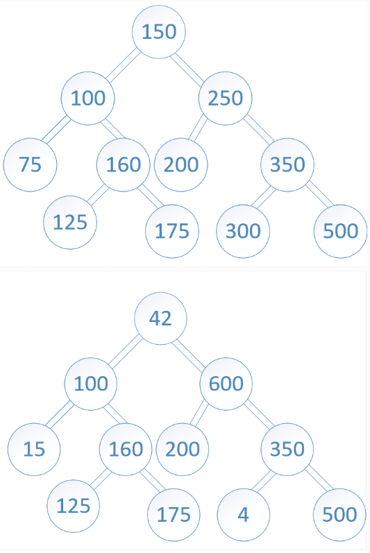
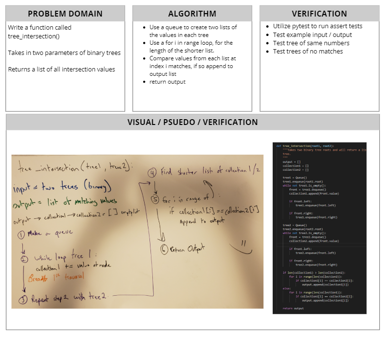

# Tree Intersection
[Table of Contents](../../../README.md)
## Challenge 32

Find common values in 2 binary trees.

## Features
- [] Write a function called tree_intersection that takes two binary tree parameters.
- [] Without utilizing any of the built-in library methods available to your language, return a set of values found in both trees.

## Examples
`Input:`

`Output` : `[100,160,125,175,200,350,500]`

---
## Approach & Efficiency

---

## Solution

