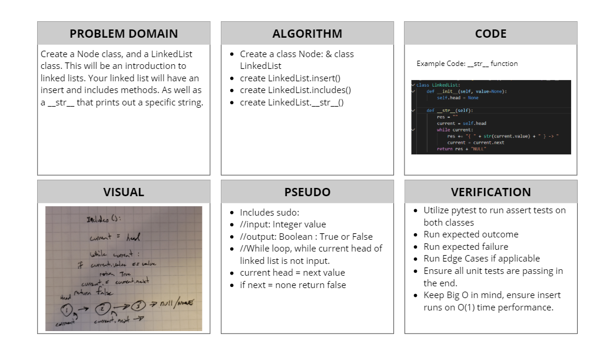

# Linked List Implementation
[Table of Contents](../../../README.md)
## Challenge 05
- Create a Node Class that has properties for the value stored in the Node, and a pointer to the next Node.
- Within your LinkedList class, include a head property. Upon instantiation, an empty Linked List should be created.
    - Define a method called `insert` which takes any value as an argument and adds a new node with that value to the `head` of the list with an O(1) Time performance.
    - Define a method called `includes` which takes any value as an argument and returns a boolean result depending on whether that value exists as a Node's value somewhere within the list.
    - Define a method called `toString` (or `__str__` in Python) which takes in no arguments and returns a string representing all the values in the Linked List, formatted as:
        - `"{a}->{b}->{c}->{NULL}"`
- Any exceptions or errors that come from your code should be semantic, capturable errors. For example, rather than a default error thrown by your language, your code should raise/throw a custom, semantic error that describes what went wrong in calling the methods your wrote for this lab.
- Be sure to follow your language/frameworks standard naming conventions.

## Approach & Efficiency
This code challenge is a bit different than others. This one we had a lot of reading and good lecture about Big O and Linked List. I followed the instructions from top to bottom. Creating the node and establishing a way to add more nodes to the linked list. The most complex piece of this challenge was to understand the reassigning of head, and ensuring each node knew of its value plus its next value. Insert came out to an O(1) efficiciency. Includes on the other hand is an O(n) as it is using a while loop, and may not find anything.

## Solution

