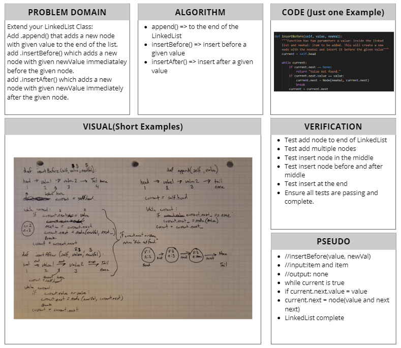

# Linked List Insertions
[Table of Contents](../../../README.md)
## Challenge 06
Extend your LinkedList Class:
- [x] `.append(value)` which adds a new node with given `value` to the end of the list.
- [x] `.insertBefore(value, newVal)` which add a new node with given `newValue` immediately before the first `value` node.
- [x] `.insertAfter(value,newVal)` which add a new node with the given `newValue` immediately after the first `value` node.

### Examples:
`.append(value)`
|input|Args|Output|
|------|-----|------|
|head -> [1] -> [3] -> [2] -> X|5|head -> [1] -> [3] -> [2] -> [5] -> X|
|head -> X|1|head -> [1] -> X|

`.insertBefore(value,newVal)`
|input|Args|Output|
|------|-----|------|
|head -> [1] -> [3] -> [2] -> X|3, 5|head -> [1] -> [5] -> [3] -> [2] -> X|
|head -> [1] -> [3] -> [2] -> X|1, 5|head -> [5] -> [1] -> [3] -> [2] -> X|
|head -> [1] -> [2] -> [2] -> X|2, 5|head -> [1] -> [5] -> [2] -> [2] -> X|
|head -> [1] -> [3] -> [2] -> X|4, 5|Exception

`.insertAter(value, newVal)`
|input|Args|Output|
|------|-----|------|
|head -> [1] -> [3] -> [2] -> X|3, 5|head -> [1] -> [3] -> [5] -> [2] -> X|
|head -> [1] -> [3] -> [2] -> X|2, 5|head -> [1] -> [3] -> [2] -> [5] -> X|
|head -> [1] -> [2] -> [2] -> X|2, 5|head -> [1] -> [2] -> [5] -> [2] -> X|
|head -> [1] -> [3] -> [2] -> X|4, 5|Exception

### Unit Tests
1.  [x] Can successfully add a node to the end of the linked list.
2.  [x] Can successfully add multiple nodes ot the end of a linked list.
3.  [x] Can successfully insert a node before a node located in the middle of a linked list.
4.  [x] Can successfully insert a node before the first node of a linked list.
5.  [x] Can successfully insert a node after a node in the middle of the linked list.
6.  [x] Can successfully insert a node after the last node of the linked list.

## Approach & Efficiency
Today's lab asked for three more methods to be added on to the LinkedList class. First, append an item to the end of a LinkedList. This method utilizings a while loop, loop through the whole list until it finds the value is right before the tail or value of None. Second/Third, insertBefore and insertAfter, Both utilize the same traversal of a while loop. Comparing either current.value or current.next value to determine where to insert the new value. All these are O(n) time efficiency as they utilze a while loop and have to iterate over the the entire LinkedList.

## Solution

