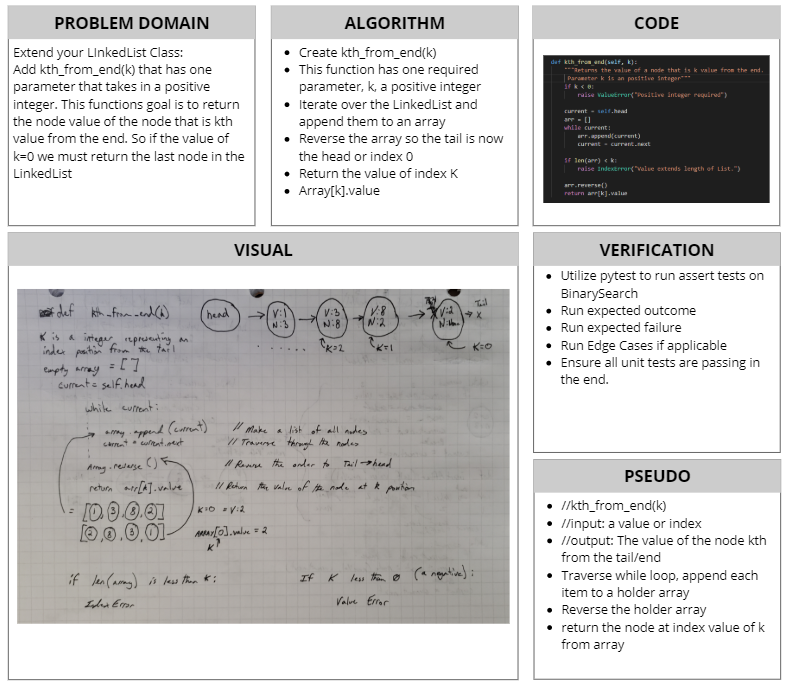

# Linked List Insertions
[Table of Contents](../../../README.md)
## Challenge 07
Extend your LinkedList Class:
- [x] Write a `kth_from_end(k)`method for the Linked List Class which takes a number, `k`, as a parameter.
    - [x] Return the node's value that is `k` from the end of the linked list. You have access to the Node class and all the properties on the Linked List class as well as the methods created in previous challenges.
### Examples:
`ll.kth_from_end(k)`
|input `ll`|Args `k`|Output|
|------|-----|------|
|head -> [1] -> [3] -> [8] -> [2] -> X|0|2|
|head -> [1] -> [3] -> [8] -> [2] -> X|2|3|
|head -> [1] -> [3] -> [8] -> [2] -> X|6|Exception|

### Unit Tests
1.  [x] Where `k` is greater than the length of the linked list.
2.  [x] Where `k` and the length of the list are the same.
3.  [x] Where `k` is not a positive integer.
4.  [x] Where the linked list is of a size 1.
5.  [x] "Happy Path" where `k` is not at the end, but somewhere in the middle of the linked list.

## Approach & Efficiency
`kth_from_end(k)` Requires us to traverse through the entire linked list at least once. So this bring Big O to a value of O(n). With the appending to a new array and reverse this array we are taking up a lot of space and increasing the Big O.

## Solution

